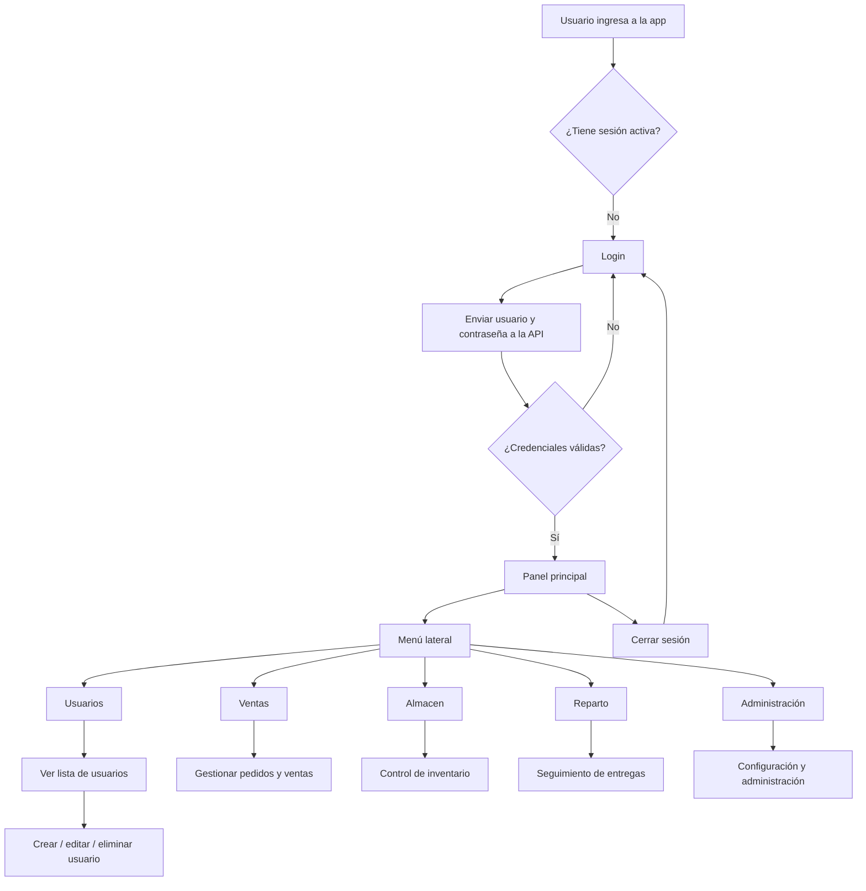

# Flujo de la aplicación

## Vista general

La aplicación inicia en una pantalla de autenticación y, una vez validado el acceso, dirige al usuario al panel principal del sistema. Desde allí se puede navegar entre los distintos módulos funcionales del negocio.

## Flujo actual implementado

La base actual del sistema tiene estas rutas principales:

- `/` → redirige a `/inicio-sesion`
- `/inicio-sesion` → pantalla de acceso
- `/panel` → panel principal de la app
- `/usuarios` → vista de administración de usuarios

## Lógica funcional por pantalla

### 1. Inicio de sesión

- `InicioSesionVista.vue` envía `usuario` y `contrasena` a `POST /api/auth/login`.
- La API consulta SQL Server y, si las credenciales son válidas, devuelve un `accessToken`.
- La interfaz guarda el token y dirige al usuario al panel; si hay un error, muestra el mensaje recibido.

### 2. Panel principal

- Después del acceso, el usuario llega al panel principal.
- Este módulo central organiza la navegación entre áreas.
- El diseño principal se construye con un layout común compuesto por encabezado, navegación lateral y contenido.

### 3. Usuarios

- La vista de usuarios muestra una tabla con datos de ejemplo.
- Se presentan campos como tipo, nombre, usuario, teléfono, estado y acciones de edición o eliminación.
- Actualmente representa una maqueta funcional de la gestión administrativa.

## Relación con los módulos

El flujo general del sistema está pensado para que cada módulo tenga una responsabilidad clara:

- Autenticación: acceso y gestión del token
- Principal: panel general
- Admin: usuarios y configuración
- Ventas: operación comercial
- Almacen: inventario y stock
- Reparto: entregas y logística

## Observación de desarrollo

El inicio de sesión ya está conectado con la API. Las pantallas de administración, inventario, ventas y reparto todavía requieren integrar sus operaciones con el backend.
