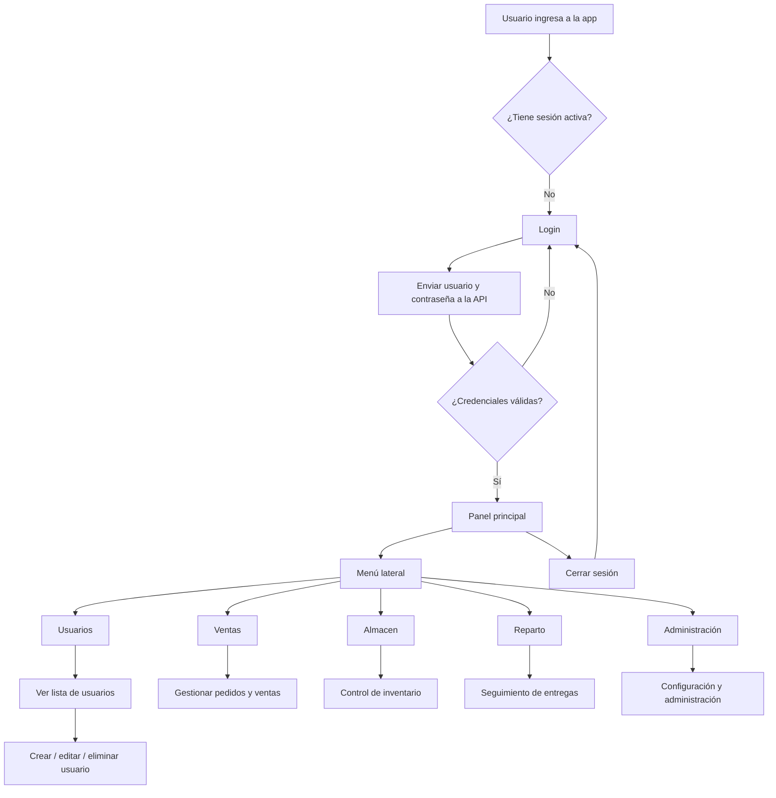
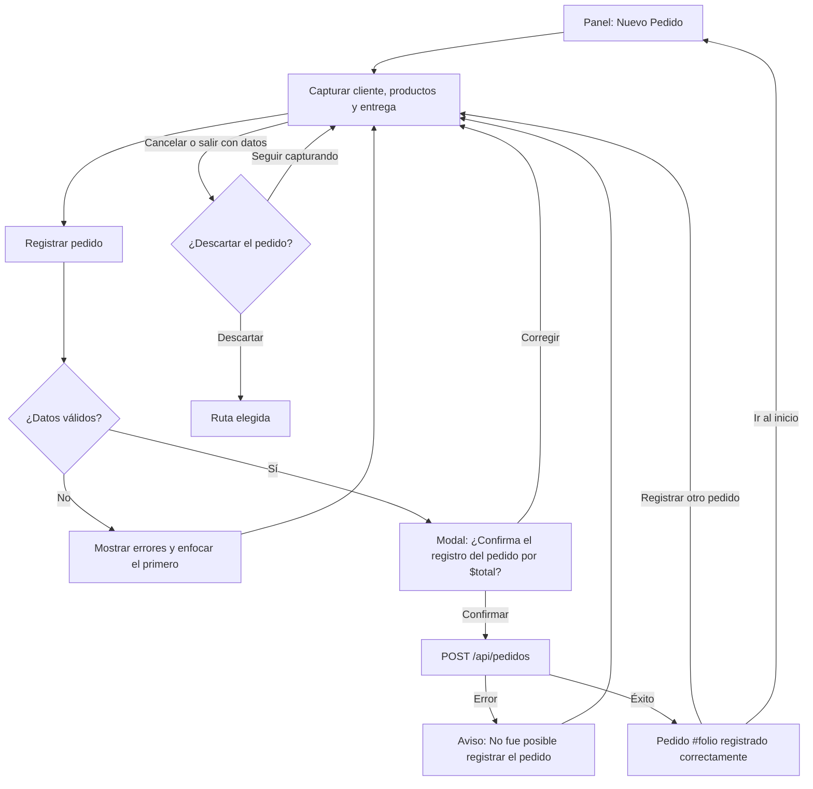

# Flujo de la aplicación

## Vista general

La aplicación inicia en una pantalla de autenticación y, una vez validado el acceso, dirige al usuario al panel principal del sistema. Desde allí se puede navegar entre los distintos módulos funcionales del negocio.

## Flujo actual implementado

La base actual del sistema tiene estas rutas principales:

- `/` → redirige a `/inicio-sesion`
- `/inicio-sesion` → pantalla de acceso
- `/panel` → panel principal de la app
- `/usuarios` → vista de administración de usuarios
- `/pedidos/nuevo` → captura y registro de un pedido (desde el botón "Nuevo Pedido" del panel)

## Lógica funcional por pantalla

### 1. Inicio de sesión

- `InicioSesionVista.vue` envía `usuario` y `contrasena` a `POST /api/auth/login`.
- La API consulta SQL Server y, si las credenciales son válidas, devuelve un `accessToken`.
- La interfaz guarda el token y dirige al usuario al panel; si hay un error, muestra el mensaje recibido.

### 2. Panel principal

- Después del acceso, el usuario llega al panel principal.
- Este módulo central organiza la navegación entre áreas.
- El diseño principal se construye con un layout común compuesto por encabezado, navegación lateral y contenido.

### 3. Usuarios

- La vista de usuarios muestra una tabla con datos de ejemplo.
- Se presentan campos como tipo, nombre, usuario, teléfono, estado y acciones de edición o eliminación.
- Actualmente representa una maqueta funcional de la gestión administrativa.

### 4. Nuevo pedido (módulo de ventas)

- `NuevoPedidoVista.vue` se divide en tres pasos y un resumen lateral que se queda fijo al desplazar. En pantallas de menos de 900 px, el resumen va debajo del formulario.
- **Cliente**:
  - Busca clientes registrados por nombre, razón social o teléfono mientras se escribe, a partir de 3 caracteres y con 300 ms de espera.
  - La lista se recorre con flechas, Enter y Escape.
  - Los clientes nuevos no se dan de alta aquí.
- **Productos**:
  - Salen del inventario real.
  - Cada renglón lleva cantidad en kg con − / + o captura directa.
  - Si la cantidad supera lo disponible, el renglón se marca al instante.
- **Entrega**:
  - Modalidad: Entrega a domicilio o Recolección en congeladora.
  - Fecha requerida, desde hoy.
  - A domicilio también pide dirección, que por defecto es la registrada del cliente, y referencias.
  - Las observaciones son opcionales, de máximo 250 caracteres.
- Al registrar se valida todo y el foco va al primer error. Si todo es válido, se confirma el resumen antes de enviar.
- La búsqueda de clientes y el registro están simulados hasta que la API tenga `GET /api/clientes` y `POST /api/pedidos`.

## Relación con los módulos

El flujo general del sistema está pensado para que cada módulo tenga una responsabilidad clara:

- Autenticación: acceso y gestión del token
- Principal: panel general
- Admin: usuarios y configuración
- Ventas: operación comercial
- Almacen: inventario y stock
- Reparto: entregas y logística

## Observación de desarrollo

El inicio de sesión y la consulta de inventario ya están conectados con la API. En ventas, Nuevo pedido usa el inventario real, pero la búsqueda de clientes y el registro del pedido siguen simulados. Las pantallas de administración y reparto todavía requieren integrar sus operaciones con el backend.
